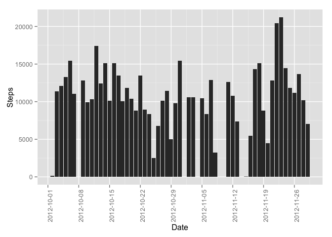

# Reproducible Research: Peer Assessment 1


## Loading and preprocessing the data
We read in the data from the .zip file distributed with the base repository.


```r
  ## Read in the data - it comes in our project's git repo as a zip of a .csv
  ## extract it and save a copy of the original data
  origData <- read.csv(unz(paste(getwd(), "/activity.zip", sep = ""), "activity.csv"))
```

## What is mean total number of steps taken per day?

```r
    ## Create a frame that contains some useful breakdowns
  origView <- data.frame(date = as.Date(levels(origData$date)), 
                      steps = aggregate(x = origData$steps, 
                                        by = list(Date=origData$date), 
                                        FUN = sum, na.rm = F)[,2], 
                      meanSteps = aggregate(x = origData$steps, 
                                        by = list(Date=origData$date), 
                                        FUN = mean, na.rm = F)[,2], 
                      medianSteps = aggregate(x = origData$steps, 
                                        by = list(Date=origData$date), 
                                        FUN = median, na.rm = F)[,2])
  
  ggplot(data = origView, 
         aes(origView$date, origView$steps)) + 
          geom_bar(stat="identity") + 
          labs(x = "Date", y = "Steps") + 
          scale_x_date(breaks = "week") +
          theme(axis.text.x = element_text(angle = 90, hjust = 1))
```

 

```r
  origXtab <- data.frame(Date = as.character(origView$date), 
                      Total = origView$steps, 
                      Average = origView$meanSteps, 
                      Median = origView$medianSteps)
```

```r
  print(xtable(origXtab, align = c("", "c", "c", "c", "c")), 
        type = "html", 
        include.rownames=FALSE)
```

<!-- html table generated in R 3.2.2 by xtable 1.8-0 package -->
<!-- Sun Nov  8 15:29:36 2015 -->
<table border=1>
<tr> <th> Date </th> <th> Total </th> <th> Average </th> <th> Median </th>  </tr>
  <tr> <td align="center"> 2012-10-01 </td> <td align="center">  </td> <td align="center">  </td> <td align="center">  </td> </tr>
  <tr> <td align="center"> 2012-10-02 </td> <td align="center"> 126 </td> <td align="center"> 0.44 </td> <td align="center"> 0.00 </td> </tr>
  <tr> <td align="center"> 2012-10-03 </td> <td align="center"> 11352 </td> <td align="center"> 39.42 </td> <td align="center"> 0.00 </td> </tr>
  <tr> <td align="center"> 2012-10-04 </td> <td align="center"> 12116 </td> <td align="center"> 42.07 </td> <td align="center"> 0.00 </td> </tr>
  <tr> <td align="center"> 2012-10-05 </td> <td align="center"> 13294 </td> <td align="center"> 46.16 </td> <td align="center"> 0.00 </td> </tr>
  <tr> <td align="center"> 2012-10-06 </td> <td align="center"> 15420 </td> <td align="center"> 53.54 </td> <td align="center"> 0.00 </td> </tr>
  <tr> <td align="center"> 2012-10-07 </td> <td align="center"> 11015 </td> <td align="center"> 38.25 </td> <td align="center"> 0.00 </td> </tr>
  <tr> <td align="center"> 2012-10-08 </td> <td align="center">  </td> <td align="center">  </td> <td align="center">  </td> </tr>
  <tr> <td align="center"> 2012-10-09 </td> <td align="center"> 12811 </td> <td align="center"> 44.48 </td> <td align="center"> 0.00 </td> </tr>
  <tr> <td align="center"> 2012-10-10 </td> <td align="center"> 9900 </td> <td align="center"> 34.38 </td> <td align="center"> 0.00 </td> </tr>
  <tr> <td align="center"> 2012-10-11 </td> <td align="center"> 10304 </td> <td align="center"> 35.78 </td> <td align="center"> 0.00 </td> </tr>
  <tr> <td align="center"> 2012-10-12 </td> <td align="center"> 17382 </td> <td align="center"> 60.35 </td> <td align="center"> 0.00 </td> </tr>
  <tr> <td align="center"> 2012-10-13 </td> <td align="center"> 12426 </td> <td align="center"> 43.15 </td> <td align="center"> 0.00 </td> </tr>
  <tr> <td align="center"> 2012-10-14 </td> <td align="center"> 15098 </td> <td align="center"> 52.42 </td> <td align="center"> 0.00 </td> </tr>
  <tr> <td align="center"> 2012-10-15 </td> <td align="center"> 10139 </td> <td align="center"> 35.20 </td> <td align="center"> 0.00 </td> </tr>
  <tr> <td align="center"> 2012-10-16 </td> <td align="center"> 15084 </td> <td align="center"> 52.38 </td> <td align="center"> 0.00 </td> </tr>
  <tr> <td align="center"> 2012-10-17 </td> <td align="center"> 13452 </td> <td align="center"> 46.71 </td> <td align="center"> 0.00 </td> </tr>
  <tr> <td align="center"> 2012-10-18 </td> <td align="center"> 10056 </td> <td align="center"> 34.92 </td> <td align="center"> 0.00 </td> </tr>
  <tr> <td align="center"> 2012-10-19 </td> <td align="center"> 11829 </td> <td align="center"> 41.07 </td> <td align="center"> 0.00 </td> </tr>
  <tr> <td align="center"> 2012-10-20 </td> <td align="center"> 10395 </td> <td align="center"> 36.09 </td> <td align="center"> 0.00 </td> </tr>
  <tr> <td align="center"> 2012-10-21 </td> <td align="center"> 8821 </td> <td align="center"> 30.63 </td> <td align="center"> 0.00 </td> </tr>
  <tr> <td align="center"> 2012-10-22 </td> <td align="center"> 13460 </td> <td align="center"> 46.74 </td> <td align="center"> 0.00 </td> </tr>
  <tr> <td align="center"> 2012-10-23 </td> <td align="center"> 8918 </td> <td align="center"> 30.97 </td> <td align="center"> 0.00 </td> </tr>
  <tr> <td align="center"> 2012-10-24 </td> <td align="center"> 8355 </td> <td align="center"> 29.01 </td> <td align="center"> 0.00 </td> </tr>
  <tr> <td align="center"> 2012-10-25 </td> <td align="center"> 2492 </td> <td align="center"> 8.65 </td> <td align="center"> 0.00 </td> </tr>
  <tr> <td align="center"> 2012-10-26 </td> <td align="center"> 6778 </td> <td align="center"> 23.53 </td> <td align="center"> 0.00 </td> </tr>
  <tr> <td align="center"> 2012-10-27 </td> <td align="center"> 10119 </td> <td align="center"> 35.14 </td> <td align="center"> 0.00 </td> </tr>
  <tr> <td align="center"> 2012-10-28 </td> <td align="center"> 11458 </td> <td align="center"> 39.78 </td> <td align="center"> 0.00 </td> </tr>
  <tr> <td align="center"> 2012-10-29 </td> <td align="center"> 5018 </td> <td align="center"> 17.42 </td> <td align="center"> 0.00 </td> </tr>
  <tr> <td align="center"> 2012-10-30 </td> <td align="center"> 9819 </td> <td align="center"> 34.09 </td> <td align="center"> 0.00 </td> </tr>
  <tr> <td align="center"> 2012-10-31 </td> <td align="center"> 15414 </td> <td align="center"> 53.52 </td> <td align="center"> 0.00 </td> </tr>
  <tr> <td align="center"> 2012-11-01 </td> <td align="center">  </td> <td align="center">  </td> <td align="center">  </td> </tr>
  <tr> <td align="center"> 2012-11-02 </td> <td align="center"> 10600 </td> <td align="center"> 36.81 </td> <td align="center"> 0.00 </td> </tr>
  <tr> <td align="center"> 2012-11-03 </td> <td align="center"> 10571 </td> <td align="center"> 36.70 </td> <td align="center"> 0.00 </td> </tr>
  <tr> <td align="center"> 2012-11-04 </td> <td align="center">  </td> <td align="center">  </td> <td align="center">  </td> </tr>
  <tr> <td align="center"> 2012-11-05 </td> <td align="center"> 10439 </td> <td align="center"> 36.25 </td> <td align="center"> 0.00 </td> </tr>
  <tr> <td align="center"> 2012-11-06 </td> <td align="center"> 8334 </td> <td align="center"> 28.94 </td> <td align="center"> 0.00 </td> </tr>
  <tr> <td align="center"> 2012-11-07 </td> <td align="center"> 12883 </td> <td align="center"> 44.73 </td> <td align="center"> 0.00 </td> </tr>
  <tr> <td align="center"> 2012-11-08 </td> <td align="center"> 3219 </td> <td align="center"> 11.18 </td> <td align="center"> 0.00 </td> </tr>
  <tr> <td align="center"> 2012-11-09 </td> <td align="center">  </td> <td align="center">  </td> <td align="center">  </td> </tr>
  <tr> <td align="center"> 2012-11-10 </td> <td align="center">  </td> <td align="center">  </td> <td align="center">  </td> </tr>
  <tr> <td align="center"> 2012-11-11 </td> <td align="center"> 12608 </td> <td align="center"> 43.78 </td> <td align="center"> 0.00 </td> </tr>
  <tr> <td align="center"> 2012-11-12 </td> <td align="center"> 10765 </td> <td align="center"> 37.38 </td> <td align="center"> 0.00 </td> </tr>
  <tr> <td align="center"> 2012-11-13 </td> <td align="center"> 7336 </td> <td align="center"> 25.47 </td> <td align="center"> 0.00 </td> </tr>
  <tr> <td align="center"> 2012-11-14 </td> <td align="center">  </td> <td align="center">  </td> <td align="center">  </td> </tr>
  <tr> <td align="center"> 2012-11-15 </td> <td align="center">  41 </td> <td align="center"> 0.14 </td> <td align="center"> 0.00 </td> </tr>
  <tr> <td align="center"> 2012-11-16 </td> <td align="center"> 5441 </td> <td align="center"> 18.89 </td> <td align="center"> 0.00 </td> </tr>
  <tr> <td align="center"> 2012-11-17 </td> <td align="center"> 14339 </td> <td align="center"> 49.79 </td> <td align="center"> 0.00 </td> </tr>
  <tr> <td align="center"> 2012-11-18 </td> <td align="center"> 15110 </td> <td align="center"> 52.47 </td> <td align="center"> 0.00 </td> </tr>
  <tr> <td align="center"> 2012-11-19 </td> <td align="center"> 8841 </td> <td align="center"> 30.70 </td> <td align="center"> 0.00 </td> </tr>
  <tr> <td align="center"> 2012-11-20 </td> <td align="center"> 4472 </td> <td align="center"> 15.53 </td> <td align="center"> 0.00 </td> </tr>
  <tr> <td align="center"> 2012-11-21 </td> <td align="center"> 12787 </td> <td align="center"> 44.40 </td> <td align="center"> 0.00 </td> </tr>
  <tr> <td align="center"> 2012-11-22 </td> <td align="center"> 20427 </td> <td align="center"> 70.93 </td> <td align="center"> 0.00 </td> </tr>
  <tr> <td align="center"> 2012-11-23 </td> <td align="center"> 21194 </td> <td align="center"> 73.59 </td> <td align="center"> 0.00 </td> </tr>
  <tr> <td align="center"> 2012-11-24 </td> <td align="center"> 14478 </td> <td align="center"> 50.27 </td> <td align="center"> 0.00 </td> </tr>
  <tr> <td align="center"> 2012-11-25 </td> <td align="center"> 11834 </td> <td align="center"> 41.09 </td> <td align="center"> 0.00 </td> </tr>
  <tr> <td align="center"> 2012-11-26 </td> <td align="center"> 11162 </td> <td align="center"> 38.76 </td> <td align="center"> 0.00 </td> </tr>
  <tr> <td align="center"> 2012-11-27 </td> <td align="center"> 13646 </td> <td align="center"> 47.38 </td> <td align="center"> 0.00 </td> </tr>
  <tr> <td align="center"> 2012-11-28 </td> <td align="center"> 10183 </td> <td align="center"> 35.36 </td> <td align="center"> 0.00 </td> </tr>
  <tr> <td align="center"> 2012-11-29 </td> <td align="center"> 7047 </td> <td align="center"> 24.47 </td> <td align="center"> 0.00 </td> </tr>
  <tr> <td align="center"> 2012-11-30 </td> <td align="center">  </td> <td align="center">  </td> <td align="center">  </td> </tr>
   </table>

## What is the average daily activity pattern?
A graph of the average steps taken per interval.

```r
  avgByInterval <- data.frame(Interval = unique(origData$interval),
                              AvgSteps = aggregate(x = origData$steps,
                                                by = list(interval = origData$interval),
                                                FUN = mean, 
                                                na.rm = T)[,2])
  plot(x = avgByInterval$Interval, 
       y = avgByInterval$AvgSteps, 
       type = "l", 
       xlab = "Interval", ylab = "Average Steps")
```

 


Interval 835 shows the maximum average number of steps with 206.1698113

## Imputing missing values
We impute missing values by using our previously generated interval-averages to demonstrate how 'NA' values (and a strategy
to replace them) can alter our outcomes.  We use a crude method of replacement - using the overall average number of steps
in our dataset, to replace 'NA' / unrecorded values.  This is intentionally 'bad' to demonstrate the impact of a poor
strategy choice.  

```r
  overallMean <- mean(origData$steps, na.rm=T)
  imputedData <- data.frame(origData)
  naCount <- length(imputedData$steps[which(is.na(imputedData$steps))])
  imputedData$steps[which(is.na(imputedData$steps))] <- overallMean

   imputedView <- data.frame(date = as.Date(levels(imputedData$date)), 
                      steps = aggregate(x = imputedData$steps, 
                                        by = list(Date=imputedData$date), 
                                        FUN = sum, na.rm = F)[,2], 
                      meanSteps = aggregate(x = imputedData$steps, 
                                        by = list(Date=imputedData$date), 
                                        FUN = mean, na.rm = F)[,2], 
                      medianSteps = aggregate(x = imputedData$steps, 
                                        by = list(Date=imputedData$date), 
                                        FUN = median, na.rm = F)[,2])
  
  ggplot(data = imputedView, 
         aes(imputedView$date, imputedView$steps)) + 
          geom_bar(stat="identity") + 
          labs(x = "Date", y = "Steps") + 
          scale_x_date(breaks = "week") +
          theme(axis.text.x = element_text(angle = 90, hjust = 1))
```

 

```r
  imputedXtab <- data.frame(Date = as.character(imputedView$date), 
                      Total = imputedView$steps, 
                      Average = imputedView$meanSteps, 
                      Median = imputedView$medianSteps)
```

```r
  print(xtable(imputedXtab, align = c("", "c", "c", "c", "c")), 
        type = "html", 
        include.rownames=FALSE)
```

<!-- html table generated in R 3.2.2 by xtable 1.8-0 package -->
<!-- Sun Nov  8 15:29:36 2015 -->
<table border=1>
<tr> <th> Date </th> <th> Total </th> <th> Average </th> <th> Median </th>  </tr>
  <tr> <td align="center"> 2012-10-01 </td> <td align="center"> 10766.19 </td> <td align="center"> 37.38 </td> <td align="center"> 37.38 </td> </tr>
  <tr> <td align="center"> 2012-10-02 </td> <td align="center"> 126.00 </td> <td align="center"> 0.44 </td> <td align="center"> 0.00 </td> </tr>
  <tr> <td align="center"> 2012-10-03 </td> <td align="center"> 11352.00 </td> <td align="center"> 39.42 </td> <td align="center"> 0.00 </td> </tr>
  <tr> <td align="center"> 2012-10-04 </td> <td align="center"> 12116.00 </td> <td align="center"> 42.07 </td> <td align="center"> 0.00 </td> </tr>
  <tr> <td align="center"> 2012-10-05 </td> <td align="center"> 13294.00 </td> <td align="center"> 46.16 </td> <td align="center"> 0.00 </td> </tr>
  <tr> <td align="center"> 2012-10-06 </td> <td align="center"> 15420.00 </td> <td align="center"> 53.54 </td> <td align="center"> 0.00 </td> </tr>
  <tr> <td align="center"> 2012-10-07 </td> <td align="center"> 11015.00 </td> <td align="center"> 38.25 </td> <td align="center"> 0.00 </td> </tr>
  <tr> <td align="center"> 2012-10-08 </td> <td align="center"> 10766.19 </td> <td align="center"> 37.38 </td> <td align="center"> 37.38 </td> </tr>
  <tr> <td align="center"> 2012-10-09 </td> <td align="center"> 12811.00 </td> <td align="center"> 44.48 </td> <td align="center"> 0.00 </td> </tr>
  <tr> <td align="center"> 2012-10-10 </td> <td align="center"> 9900.00 </td> <td align="center"> 34.38 </td> <td align="center"> 0.00 </td> </tr>
  <tr> <td align="center"> 2012-10-11 </td> <td align="center"> 10304.00 </td> <td align="center"> 35.78 </td> <td align="center"> 0.00 </td> </tr>
  <tr> <td align="center"> 2012-10-12 </td> <td align="center"> 17382.00 </td> <td align="center"> 60.35 </td> <td align="center"> 0.00 </td> </tr>
  <tr> <td align="center"> 2012-10-13 </td> <td align="center"> 12426.00 </td> <td align="center"> 43.15 </td> <td align="center"> 0.00 </td> </tr>
  <tr> <td align="center"> 2012-10-14 </td> <td align="center"> 15098.00 </td> <td align="center"> 52.42 </td> <td align="center"> 0.00 </td> </tr>
  <tr> <td align="center"> 2012-10-15 </td> <td align="center"> 10139.00 </td> <td align="center"> 35.20 </td> <td align="center"> 0.00 </td> </tr>
  <tr> <td align="center"> 2012-10-16 </td> <td align="center"> 15084.00 </td> <td align="center"> 52.38 </td> <td align="center"> 0.00 </td> </tr>
  <tr> <td align="center"> 2012-10-17 </td> <td align="center"> 13452.00 </td> <td align="center"> 46.71 </td> <td align="center"> 0.00 </td> </tr>
  <tr> <td align="center"> 2012-10-18 </td> <td align="center"> 10056.00 </td> <td align="center"> 34.92 </td> <td align="center"> 0.00 </td> </tr>
  <tr> <td align="center"> 2012-10-19 </td> <td align="center"> 11829.00 </td> <td align="center"> 41.07 </td> <td align="center"> 0.00 </td> </tr>
  <tr> <td align="center"> 2012-10-20 </td> <td align="center"> 10395.00 </td> <td align="center"> 36.09 </td> <td align="center"> 0.00 </td> </tr>
  <tr> <td align="center"> 2012-10-21 </td> <td align="center"> 8821.00 </td> <td align="center"> 30.63 </td> <td align="center"> 0.00 </td> </tr>
  <tr> <td align="center"> 2012-10-22 </td> <td align="center"> 13460.00 </td> <td align="center"> 46.74 </td> <td align="center"> 0.00 </td> </tr>
  <tr> <td align="center"> 2012-10-23 </td> <td align="center"> 8918.00 </td> <td align="center"> 30.97 </td> <td align="center"> 0.00 </td> </tr>
  <tr> <td align="center"> 2012-10-24 </td> <td align="center"> 8355.00 </td> <td align="center"> 29.01 </td> <td align="center"> 0.00 </td> </tr>
  <tr> <td align="center"> 2012-10-25 </td> <td align="center"> 2492.00 </td> <td align="center"> 8.65 </td> <td align="center"> 0.00 </td> </tr>
  <tr> <td align="center"> 2012-10-26 </td> <td align="center"> 6778.00 </td> <td align="center"> 23.53 </td> <td align="center"> 0.00 </td> </tr>
  <tr> <td align="center"> 2012-10-27 </td> <td align="center"> 10119.00 </td> <td align="center"> 35.14 </td> <td align="center"> 0.00 </td> </tr>
  <tr> <td align="center"> 2012-10-28 </td> <td align="center"> 11458.00 </td> <td align="center"> 39.78 </td> <td align="center"> 0.00 </td> </tr>
  <tr> <td align="center"> 2012-10-29 </td> <td align="center"> 5018.00 </td> <td align="center"> 17.42 </td> <td align="center"> 0.00 </td> </tr>
  <tr> <td align="center"> 2012-10-30 </td> <td align="center"> 9819.00 </td> <td align="center"> 34.09 </td> <td align="center"> 0.00 </td> </tr>
  <tr> <td align="center"> 2012-10-31 </td> <td align="center"> 15414.00 </td> <td align="center"> 53.52 </td> <td align="center"> 0.00 </td> </tr>
  <tr> <td align="center"> 2012-11-01 </td> <td align="center"> 10766.19 </td> <td align="center"> 37.38 </td> <td align="center"> 37.38 </td> </tr>
  <tr> <td align="center"> 2012-11-02 </td> <td align="center"> 10600.00 </td> <td align="center"> 36.81 </td> <td align="center"> 0.00 </td> </tr>
  <tr> <td align="center"> 2012-11-03 </td> <td align="center"> 10571.00 </td> <td align="center"> 36.70 </td> <td align="center"> 0.00 </td> </tr>
  <tr> <td align="center"> 2012-11-04 </td> <td align="center"> 10766.19 </td> <td align="center"> 37.38 </td> <td align="center"> 37.38 </td> </tr>
  <tr> <td align="center"> 2012-11-05 </td> <td align="center"> 10439.00 </td> <td align="center"> 36.25 </td> <td align="center"> 0.00 </td> </tr>
  <tr> <td align="center"> 2012-11-06 </td> <td align="center"> 8334.00 </td> <td align="center"> 28.94 </td> <td align="center"> 0.00 </td> </tr>
  <tr> <td align="center"> 2012-11-07 </td> <td align="center"> 12883.00 </td> <td align="center"> 44.73 </td> <td align="center"> 0.00 </td> </tr>
  <tr> <td align="center"> 2012-11-08 </td> <td align="center"> 3219.00 </td> <td align="center"> 11.18 </td> <td align="center"> 0.00 </td> </tr>
  <tr> <td align="center"> 2012-11-09 </td> <td align="center"> 10766.19 </td> <td align="center"> 37.38 </td> <td align="center"> 37.38 </td> </tr>
  <tr> <td align="center"> 2012-11-10 </td> <td align="center"> 10766.19 </td> <td align="center"> 37.38 </td> <td align="center"> 37.38 </td> </tr>
  <tr> <td align="center"> 2012-11-11 </td> <td align="center"> 12608.00 </td> <td align="center"> 43.78 </td> <td align="center"> 0.00 </td> </tr>
  <tr> <td align="center"> 2012-11-12 </td> <td align="center"> 10765.00 </td> <td align="center"> 37.38 </td> <td align="center"> 0.00 </td> </tr>
  <tr> <td align="center"> 2012-11-13 </td> <td align="center"> 7336.00 </td> <td align="center"> 25.47 </td> <td align="center"> 0.00 </td> </tr>
  <tr> <td align="center"> 2012-11-14 </td> <td align="center"> 10766.19 </td> <td align="center"> 37.38 </td> <td align="center"> 37.38 </td> </tr>
  <tr> <td align="center"> 2012-11-15 </td> <td align="center"> 41.00 </td> <td align="center"> 0.14 </td> <td align="center"> 0.00 </td> </tr>
  <tr> <td align="center"> 2012-11-16 </td> <td align="center"> 5441.00 </td> <td align="center"> 18.89 </td> <td align="center"> 0.00 </td> </tr>
  <tr> <td align="center"> 2012-11-17 </td> <td align="center"> 14339.00 </td> <td align="center"> 49.79 </td> <td align="center"> 0.00 </td> </tr>
  <tr> <td align="center"> 2012-11-18 </td> <td align="center"> 15110.00 </td> <td align="center"> 52.47 </td> <td align="center"> 0.00 </td> </tr>
  <tr> <td align="center"> 2012-11-19 </td> <td align="center"> 8841.00 </td> <td align="center"> 30.70 </td> <td align="center"> 0.00 </td> </tr>
  <tr> <td align="center"> 2012-11-20 </td> <td align="center"> 4472.00 </td> <td align="center"> 15.53 </td> <td align="center"> 0.00 </td> </tr>
  <tr> <td align="center"> 2012-11-21 </td> <td align="center"> 12787.00 </td> <td align="center"> 44.40 </td> <td align="center"> 0.00 </td> </tr>
  <tr> <td align="center"> 2012-11-22 </td> <td align="center"> 20427.00 </td> <td align="center"> 70.93 </td> <td align="center"> 0.00 </td> </tr>
  <tr> <td align="center"> 2012-11-23 </td> <td align="center"> 21194.00 </td> <td align="center"> 73.59 </td> <td align="center"> 0.00 </td> </tr>
  <tr> <td align="center"> 2012-11-24 </td> <td align="center"> 14478.00 </td> <td align="center"> 50.27 </td> <td align="center"> 0.00 </td> </tr>
  <tr> <td align="center"> 2012-11-25 </td> <td align="center"> 11834.00 </td> <td align="center"> 41.09 </td> <td align="center"> 0.00 </td> </tr>
  <tr> <td align="center"> 2012-11-26 </td> <td align="center"> 11162.00 </td> <td align="center"> 38.76 </td> <td align="center"> 0.00 </td> </tr>
  <tr> <td align="center"> 2012-11-27 </td> <td align="center"> 13646.00 </td> <td align="center"> 47.38 </td> <td align="center"> 0.00 </td> </tr>
  <tr> <td align="center"> 2012-11-28 </td> <td align="center"> 10183.00 </td> <td align="center"> 35.36 </td> <td align="center"> 0.00 </td> </tr>
  <tr> <td align="center"> 2012-11-29 </td> <td align="center"> 7047.00 </td> <td align="center"> 24.47 </td> <td align="center"> 0.00 </td> </tr>
  <tr> <td align="center"> 2012-11-30 </td> <td align="center"> 10766.19 </td> <td align="center"> 37.38 </td> <td align="center"> 37.38 </td> </tr>
   </table>

The above histogram and table are the result of replacing 2304 uncollected data points in the original dataset with the 
value 37.3825996.  A few changes of note:

  * Some medians are now non-zerio
  * There are no days reporting zero total steps
  * While ceilings are not noticeably increased, floors are significantly higher
  
  
## Are there differences in activity patterns between weekdays and weekends?
We use the imputedView calculated above with a bit of factor manipulation to introspect into activity patterns on 
weekend days (Saturday, Sunday) vs week days.

```r
  ## Alter the existing 'date' column into the 'weekdays()' format
  # Levels: Friday Monday Saturday Sunday Thursday Tuesday Wednesday
  imputedData$date <- factor(weekdays(as.Date(as.character(imputedData$date))))
  
  ## Alter the (now factored) date field again to read either 'Weekday' or 'Weekend'
  dayTypeFactor <- c("Weekday", # Friday 
                     "Weekday", # Monday
                     "Weekend", # Saturday 
                     "Weekend", # Sunday 
                     "Weekday", # Thursday 
                     "Weekday", # Tuesday 
                     "Weekday") # Wednesday
  
  ## Compress them
  imputedData$date <- factor(dayTypeFactor[imputedData$date])
  
  ## Aggregate by factors over intervals
  avgImputedByInterval <- data.frame(
                            aggregate(
                              x = imputedData$steps,
                              by = list(
                                interval = imputedData$interval, 
                                date = imputedData$date),
                              FUN = mean, 
                              na.rm = T))
  
  ## Create a facet grid based on our new factors ('Weekday' and 'Weekend')
  ggplot(data = avgImputedByInterval, 
         aes(avgImputedByInterval$interval, avgImputedByInterval$x)) + 
          geom_line() + 
          labs(x = "Interval", y = "Average Steps Taken") +
          facet_wrap(~ date, ncol = 1)
```

 
  
As the graph illustrates, weekdays show more activity earlier and later in the day (perhaps before and after work / school / etc)
with weekends showing more consistent activity in the center of the day (perhaps during leisure activities).
